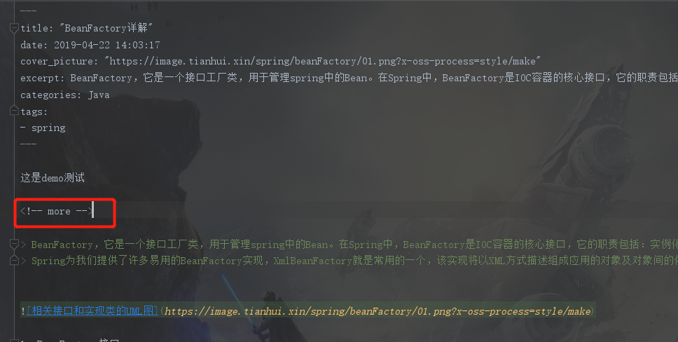

# fun 

> 兴趣


## 更新日志

2019-08-16

* 加入hexo主题

2019-08-18

* 加入分词搜索

2019-08-20

* 加入静态资源版本号

## 安装

想要把hexo的主题应用到自己的博客上，需要在本地先构建好hexo所依赖的环境。[hexo使用文档](https://hexo.io/zh-cn/docs/index.html)
大致的步骤是这样的：
- 安装git
- 安装node.js
- 安装hexo

``` 
$ npm install -g hexo-cli
```
- 构建站点

```
    $ hexo init d://Blog
    $ cd d://Blog
    $ npm install
```

- clone主题
这个时候已经构建好了站点，但是使用的主题是hexo默认的`landscape`。所以如果需要变更为`fun`主题，就需要从github上clone到本地，修改文件名为`fun`，并且放到`d://Blog/theme`下
[hexo-theme-fun主题](https://github.com/homeant/hexo-theme-fun)
- 修改主题
然后把blog目录下的`_config.yml`配置文件里的`theme: landscape`改成`fun`即可
- 安装依赖包
hexo里每个不同的主题所依赖的包都不尽相同。安装的默认主题已经包含了一些依赖包，但是对于`fun`这个主题来说是不够的，所以还需要安装以下几个:

```
    npm install --save hexo-renderer-jade hexo-generator-feed hexo-generator-archive hexo-renderer-sass get-value segment
```

## 使用说明

### 文章变量

```yaml
title: "文章标题"
date: 2018-04-30 23:00:00
author: homeant
cover_picture: # 文章图片，可选
desc: #文章的描述
keywords： #文章的关键字
top: 1 #置顶文章，可选
categories: #文章分类
tags: #文章标签，可选
```

### 文章摘要

如果你想创建文章摘要用于向读者展示文章的核心内容，那么需要在文章摘要之后其他内容之前添加 HTML 注释标签 `<!--more-->`，使用方法如下图所示：




### 评论插件

hexo-theme-fun 可以选择 *gitalk* 或者 *gitment*

[gitment](https://github.com/imsun/gitment)  
[gitalk](https://github.com/gitalk/gitalk)


```yaml
comment:
  gitalk:
    enable: true
    owner: #所有者
    repo: #仓库
    clientID: #你的github outhApp clientID
    clientSecret: #你的github outhApp clientSecret
  gitment:
    enable: false
    owner: #所有者
    repo: #仓库
    clientID: #你的github outhApp clientID
    clientSecret: #你的github outhApp clientSecret
```

